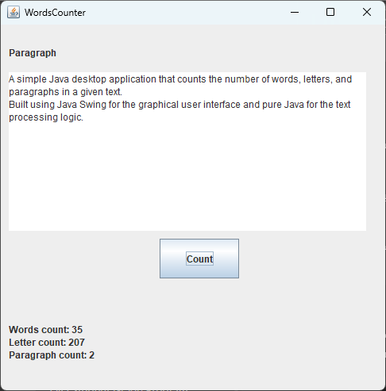

# Word Counter Application

A simple and user-friendly **Java Desktop Application** that analyzes text and provides:
- ✅ **Word Count**
- ✅ **Letter Count**
- ✅ **Paragraph Count**

**Built using:**
- Java Swing (for GUI)
- Pure Java (for text processing logic)

## Screenshot


## How to Use

1. **Enter or paste** your text in the provided text area.
2. Click **"Count"**.
3. Instantly view:
   - Total number of words.
   - Total number of letters.
   - Total number of paragraphs.
## Installation

- Download and run the **`installer.exe`** if you're using **Windows**.
**note: its size 1.8MB**

*OR*

- Compile and run using Java:

```bash
javac .\Java\TextAnalyzer.java .\Java\WordCounterGUI.java
java Java.WordCounterGUI
```